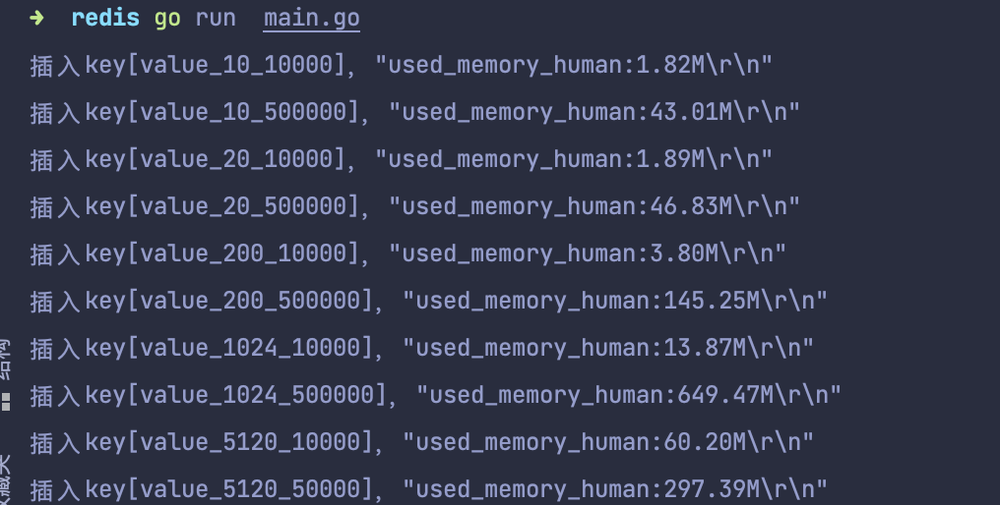

# redis benchmark 工具, 测试 10 20 50 100 200 1k 5k 字节 value 大小，redis get set 性能

主机2核4G

```
    redis-benchmark -p 6379 -c 50 -n 1000000 -t get -d 10
```


| get/s | set/s | value字节数 |
|-----|-----|------|
| 94286.25 | 94232.94   | 10 |
| 94046.83| 94312.93   | 20 |
| 94330.73| 92807.43   | 50 |
| 93738.28| 95029.94   | 100 |
| 94099.94| 94741.83   | 200 |
| 93484.16| 91987.85   | 1k |
| 92225.40| 89911.89   | 5k |

